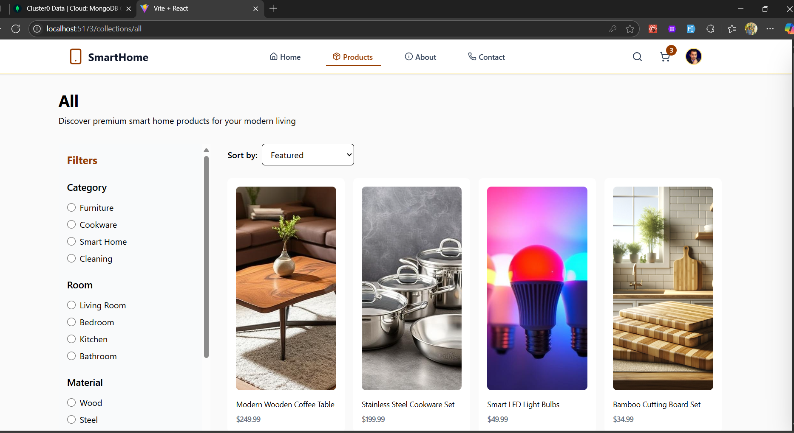
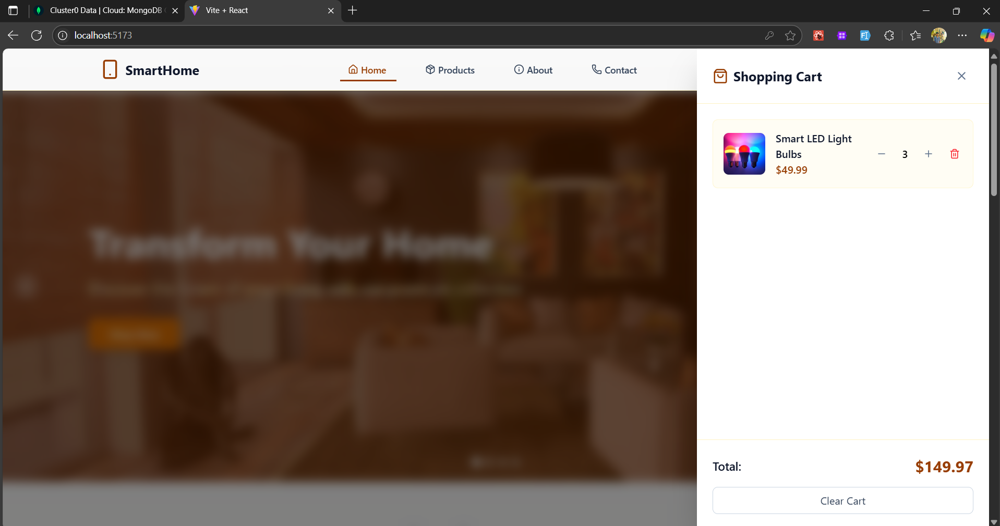
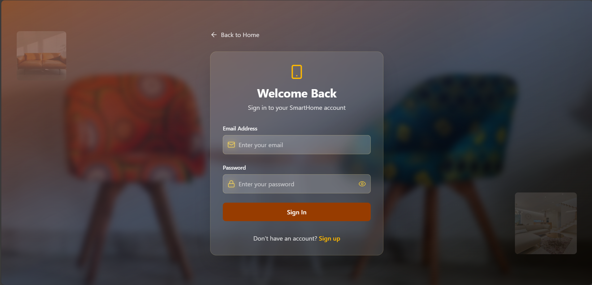
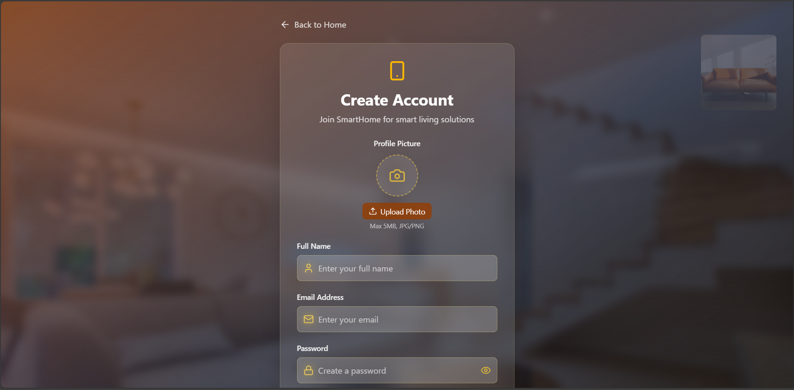
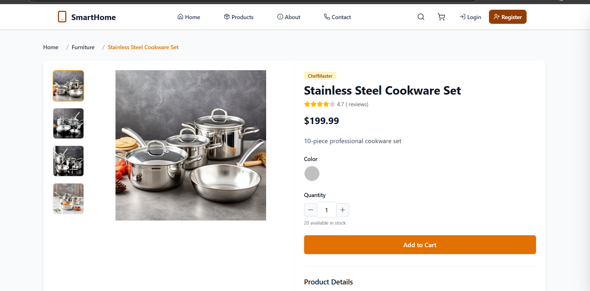

# JenutCart - E-Commerce Platform 🛒

## Screen shots

## Tech Stack ⚙️

| Category         | Technology       |
| ---------------- | ---------------- |
| Frontend         | React.js         |
| Backend          | Node.js, Express |
| State Management | Redux Toolkit    |
| Database         | MongoDB Atlas    |
| Authentication   | JWT              |
| Image Storage    | Cloudinary       |
| Styling          | Tailwind CSS     |

## Project Structure 📂

jenutcart/
├── client/ # React Frontend
│ ├── src/
│ │ ├── Pages/
│ │ │ ├── About.jsx
│ │ │ ├── Collections.jsx
│ │ │ ├── Contact.jsx
│ │ │ ├── Home.jsx
│ │ │ ├── Login.jsx
│ │ │ └── Register.jsx
│ │ │
│ │ ├── Components/
│ │ │ ├── Cart/
│ │ │ │ └── CartSidebar.jsx
│ │ │ ├── Common/
│ │ │ │ ├── Footer.jsx
│ │ │ │ ├── Navbar.jsx
│ │ │ │ ├── SearchBar.jsx
│ │ │ │ └── SortOptions.jsx
│ │ │ ├── Layout/
│ │ │ │ ├── Categories.jsx
│ │ │ │ ├── Hero.jsx
│ │ │ │ ├── ProductCarousel.jsx
│ │ │ │ └── UserLayout.jsx
│ │ │ └── Products/
│ │ │ ├── FilterSidebar.jsx
│ │ │ ├── ProductDetails.jsx
│ │ │ ├── ProductGrid.jsx
│ │ │ └── SortOptions.jsx
│ │ │
│ │ ├── redux/
│ │ │ ├── slices/
│ │ │ │ ├── auth.slice.js
│ │ │ │ ├── cart.slice.js
│ │ │ │ └── product.slice.js
│ │ │ └── store.js
│ │ │
│ │ ├── App.jsx
│ │ └── Main.jsx
│ │
│ └── .env
│
└── server/ # Node.js Backend
├── Controllers/
│ ├── auth.controller.js
│ ├── cart.controller.js
│ └── product.controller.js
│
├── data/
│ └── product.js
│
├── db/
│ └── connectToMongoDb.js
│
├── middleware/
│ ├── authMiddleware.js
│ └── multer.js
│
├── models/
│ ├── cart.model.js
│ ├── product.model.js
│ └── user.model.js
│
├── routes/
│ ├── auth.routes.js
│ ├── cart.routes.js
│ └── product.routes.js
│
├── utils/
│ ├── cloudinary.js
│ └── generateToken.js
│
├── .env
├── seeder.js
└── server.js

## Features ✨

- User authentication (Login/Register) 🔐
- Product browsing and filtering 🔍
- Shopping cart functionality 🛒
- Product categories and collections 🏷️
- Responsive design 📱💻

## API Endpoints 📍

### Authentication 🔐

| Method | Endpoint            | Description                  | Access  | Requirements                                |
| ------ | ------------------- | ---------------------------- | ------- | ------------------------------------------- |
| POST   | `/api/auth/signup`  | User registration with image | Public  | `name`, `email`, `password`, `image` (file) |
| POST   | `/api/auth/login`   | User login                   | Public  | `email`, `password`                         |
| POST   | `/api/auth/logout`  | User logout                  | Private | Valid JWT                                   |
| GET    | `/api/auth/profile` | Get user profile data        | Private | Valid JWT                                   |

### Cart 🛒

| Method | Endpoint     | Description       | Access  | Requirements                 |
| ------ | ------------ | ----------------- | ------- | ---------------------------- |
| POST   | `/api/cart/` | Create new cart   | Private | Valid JWT, product data      |
| GET    | `/api/cart/` | Get user's cart   | Private | Valid JWT                    |
| DELETE | `/api/cart/` | Empty cart        | Private | Valid JWT                    |
| PUT    | `/api/cart/` | Update cart items | Private | Valid JWT, updated cart data |

### Products 🛍️

| Method | Endpoint                     | Description          | Access | Requirements            |
| ------ | ---------------------------- | -------------------- | ------ | ----------------------- |
| POST   | `/api/products/`             | Create new product   | Admin  | Valid JWT, product data |
| GET    | `/api/products/`             | Get all products     | Public | -                       |
| GET    | `/api/products/new-arrivals` | Get new arrivals     | Public | -                       |
| GET    | `/api/products/:id`          | Get single product   | Public | -                       |
| GET    | `/api/products/similar/:id`  | Get similar products | Public | -                       |
| GET    | `/api/products/best-seller`  | Get best sellers     | Public | -                       |

### Newsletter ✉️

| Method | Endpoint         | Description          | Access | Requirements |
| ------ | ---------------- | -------------------- | ------ | ------------ |
| POST   | `/api/subscribe` | Add email subscriber | Public | `email`      |

## Screenshots 📸

### Home Page

_Landing page with featured products and categories_

### Product Listing

_All products view with filtering options_

### Shopping Cart

_User's cart with items and checkout button_

### Authentication

_User login form_

_User registration form_

### Product Details

_Detailed product view with image gallery_

## Setup Instructions 🛠️

### Prerequisites

- Node.js (v14+) 🟢
- MongoDB Atlas account 🗄️
- Cloudinary account ☁️

### Backend Setup

- cd Server

  npm install

#### Create .env file with these variables:

- PORT=5000
- MONGO_URI=your_mongodb_atlas_connection_string
- JWT_SECRET=your_jwt_secret_key
- CLOUDINARY_CLOUD_NAME=your_cloudinary_name
- CLOUDINARY_API_KEY=your_cloudinary_key
- CLOUDINARY_API_SECRET=your_cloudinary_secret

#### run the seeder

- npm run seed

##### start the server

- npm start

### Frontend Setup

- cd Server

  npm install

#### Create .env file with these variables:

- REACT_APP_API_URL=http://localhost:5000

##### start the server

- npm run dev

##### Running the Application 🚀

- Start both server and client in separate terminals
- Access frontend at: http://localhost:5173
- API will be available at: http://localhost:5000
